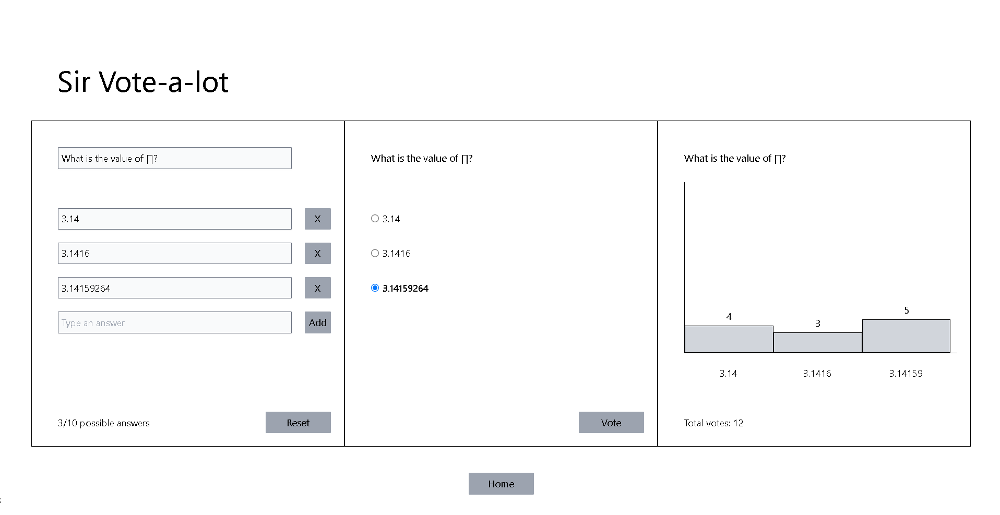

### Poll App - Technical Assignment

### Demo

[](https://poll-app-pearl.vercel.app/poll)

Steps taken for the development:

1. I read & understood the full assignment to take away the requirements so I can create mini tasks, evaluate & time box them & then prioritise each as per the importance level & the logical order. 1. Evaluating approach followed for Importance: High = 3, Med = 2, Low = 1 2. Evaluating approach followed for Complexity: High = 3, Med = 2, Low = 1 3. Evaluating approach followed for the Logical-Order: Hight = 6, Med = 3, Low = 1 4. The task is evaluated by combining the points & then should be prioritised based on the highest score 5. Tasks Created:

```
   Task - [ Importance - Complexity - Order - Total - score ]
   Analyse the assignment & translate it into backlog - [ 3 3 6 12 ]
   create & setup the Next app & the needed packages - [ 3 2 6 11 ]
   create a private Github repo & sync the local with the remote - [ 3 1 6 10 ]
   structure the folders/files & styled a basic layout - [ 3 2 6 11 ]
   create the first section, the user can create a poll with up to 10 options. - [ 3 1 6 10 ]
   create the central section, the user can vote by selecting one of the options and pressing the "vote" button. - [ 3 1 6 10 ]
   create the right, the chart will update based on the questions created and the votes that each question got.  - [3 2 3 8 ]

```

This is a [Next.js](https://nextjs.org/) project bootstrapped with [`create-next-app`](https://github.com/vercel/next.js/tree/canary/packages/create-next-app).

## Getting Started

First, run the development server:

```bash
npm run dev
# or
yarn dev
# or
pnpm dev
```

Open [http://localhost:3000](http://localhost:3000) with your browser to see the result.
